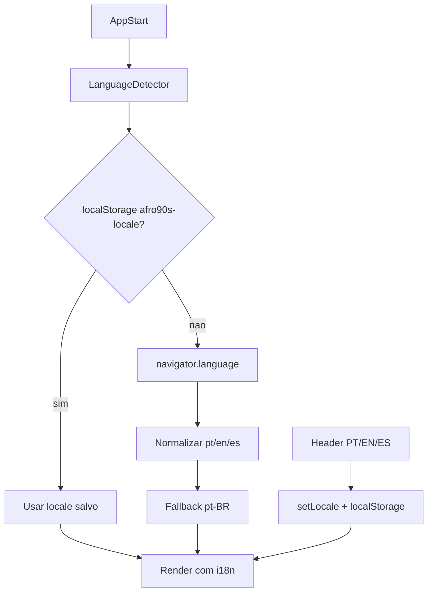

# Task 18 — Internacionalização (i18n)

**Fase:** 5 — Pós-v1  
**Status:** pendente  
**Arquivos alvo:** [`integration.md`](../integration.md), [`ui-ux.md`](../ui-ux.md), [`overview.md`](../overview.md)

## Objetivo

Extrair strings da UI para arquivos de tradução e permitir **pt-BR**, **en** e **es** na loja pública e no admin, sem alterar contratos HTTP (API continua retornando `code`).

> Hoje o frontend é pt-BR fixo: strings inline nos componentes, [`errorMessages.ts`](../../../src/lib/errorMessages.ts), Zod em [`checkout.ts`](../../../src/lib/checkout.ts), `formatPrice` com locale hardcoded.

## Fora de escopo

- Traduzir conteúdo de negócio da API (nome/descrição de produto — dados do admin)
- i18n no backend ou exibir mensagens `message` da API na UI
- RTL ou formatação multi-moeda (permanece **BRL**)
- CEP, telefone e fluxo WhatsApp específicos do Brasil (labels traduzidos; validação BR mantida)

## Decisões

| Decisão | Valor |
|---------|-------|
| Biblioteca | `react-i18next` + `i18next` |
| Idiomas v1 i18n | `pt-BR`, `en`, `es` |
| Locale padrão | `pt-BR` |
| Detecção | `i18next-browser-languagedetector` (navigator → localStorage) |
| Override | Seletor compacto no Header (`PT` / `EN` / `ES`) |
| Persistência | `localStorage` key `afro90s-locale` |
| Namespaces | `common`, `catalog`, `product`, `cart`, `errors`, `admin` |
| Formatação | `Intl` via helper `formatPrice(locale)` — não hardcode `pt-BR` |

## O que implementar

### Setup

- [ ] `npm install i18next react-i18next i18next-browser-languagedetector`
- [ ] `src/lib/i18n.ts` — init, fallback `pt-BR`, namespaces, detector order
- [ ] `src/locales/{pt-BR,en,es}/*.json` — um arquivo por namespace
- [ ] Init em `main.tsx` antes do render
- [ ] `document.documentElement.lang` reativo ao locale ativo

### Loja pública (prioridade)

- [ ] `src/components/layout/Header.tsx` — nav, busca, seletor de idioma
- [ ] `src/components/layout/Footer.tsx` — seções LOJA / CONTATO / SOBRE
- [ ] `src/pages/catalog/CatalogPage.tsx` — empty/error, contador de itens
- [ ] `src/components/product/ProductDetailModal.tsx` — CTAs, galeria, toasts
- [ ] `src/components/cart/CartDrawer.tsx` — checkout, confirmação, labels
- [ ] `src/pages/NotFoundPage.tsx`

### Libs compartilhadas

- [ ] `src/lib/errorMessages.ts` → `getClientErrorMessage(code)` usa `i18n.t('errors:CODE')`
- [ ] `src/lib/checkout.ts` — schema Zod com mensagens via factory `createCheckoutSchema(t)` ou `zod-i18n-map`
- [ ] `src/lib/whatsapp.ts` — templates de mensagem por locale
- [ ] `src/lib/format.ts` — `formatPrice(price, locale?)` usando locale ativo

### Admin (após loja pública)

- [ ] `src/pages/admin/AdminLoginPage.tsx`
- [ ] `src/pages/admin/AdminPage.tsx` + tabs (tasks 13–14 quando existirem)

### A11y

- [ ] `aria-label` e skip link traduzidos
- [ ] Manter `lang` correto para leitores de tela

### Documentação

- [ ] Seção i18n em [integration.md](../integration.md)
- [ ] Atualizar [overview.md](../overview.md) — stack + estrutura `locales/`

## Estrutura sugerida

```
src/
├── lib/i18n.ts
├── locales/
│   ├── pt-BR/
│   │   ├── common.json
│   │   ├── catalog.json
│   │   ├── product.json
│   │   ├── cart.json
│   │   ├── errors.json
│   │   └── admin.json
│   ├── en/   (mesma estrutura)
│   └── es/   (mesma estrutura)
└── hooks/useLocale.ts   (opcional — wrapper para t + setLocale)
```

## Chaves — exemplos

| Antes (hardcoded) | Depois |
|-------------------|--------|
| `"Nenhum produto encontrado"` | `t('catalog:empty.title')` |
| `"Informe seu nome completo"` | `t('cart:validation.name')` |
| `getClientErrorMessage('NOT_FOUND')` | `t('errors:NOT_FOUND')` |
| `"Olá! Vim pelo site Afro90s."` | `t('cart:whatsapp.contactMessage')` |

## Fluxo de locale



## Ordem de implementação recomendada

1. Setup `i18n.ts` + namespaces vazios + detector
2. Migrar `errors` + `formatPrice` (base para toasts e API)
3. Header/Footer + seletor
4. Catalog → Modal → CartDrawer
5. WhatsApp + Zod checkout
6. Admin
7. Testes + docs + traduções en/es revisadas

## Pré-requisitos

- Task 17 concluída (frontend v1 aceito)
- Strings das fases 1–3 estáveis (evitar retrabalho durante CRUD admin)

## Critérios de conclusão

- [ ] Loja pública inteira navegável em pt-BR, en e es
- [ ] Seletor no Header persiste escolha entre sessões
- [ ] Primeira visita respeita idioma do navegador (com fallback pt-BR)
- [ ] Erros da API exibem mensagem traduzida por `code` (nunca `message` do backend)
- [ ] `formatPrice` e `document.documentElement.lang` seguem locale ativo
- [ ] Testes: `errorMessages`/i18n smoke + pelo menos um teste de troca de locale
- [ ] Admin traduzido (mínimo login + shell do painel)
- [ ] Atualizar **Status** para `concluída`

## Estimativa de esforço

| Área | Complexidade |
|------|----------------|
| Setup + Header switcher | Baixa |
| Loja pública (~6 componentes) | Média |
| errorMessages + Zod + WhatsApp | Média |
| Admin | Média (depende tasks 13–14) |
| Traduções en/es (copy) | Média — revisão humana recomendada |

## Riscos / notas

- **Pluralização**: contador "1 ITEM / N ITENS" — usar `t('catalog:itemCount', { count })` com plural rules do i18next
- **Strings longas no drawer**: migrar em lote por namespace para evitar PR gigante
- **SEO**: `document.title` por página/modal já existe — passar por `t()`
- **Deploy**: arquivos JSON entram no bundle Vite; sem env `VITE_*` extra na v1 do i18n
- **Não instalar deps** antes da task 17 estar concluída

## O que não fazer

- Não traduzir produtos no frontend — conteúdo de negócio, não i18n de UI
- Não criar ADR em afro90sInfra — decisão local ao frontend; documentar em `integration.md`
