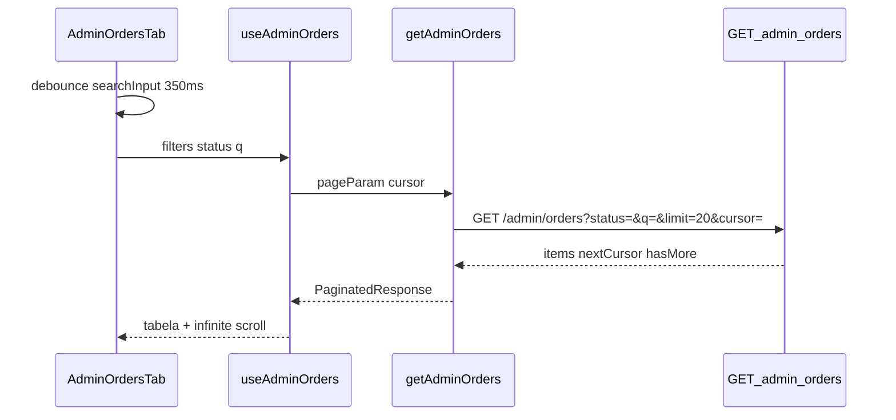

# Task 20 — Admin — Busca na tab Pedidos

**Fase:** 3 — Painel admin (extensão)  
**Status:** concluída  
**Arquivos alvo:** [`integration.md`](../integration.md), [`ui-ux.md`](../ui-ux.md), [`api-routes.md`](../../backend/api-routes.md)

## História de usuário

**Como** administrador autenticado no painel  
**Quero** buscar pedidos por ID ou nome do cliente na tab Pedidos  
**Para** localizar pedidos rapidamente em auditorias, sem percorrer páginas manualmente

### Critérios de aceite

| # | Cenário | Resultado esperado |
|---|---------|-------------------|
| 1 | Abro `/admin` (tab Pedidos) sem digitar nada | Lista todos os pedidos, **mais recentes primeiro** (`GET /admin/orders`) |
| 2 | Digito prefixo do nome (ex.: `mar`) | Após debounce, chama `GET /admin/orders?q=mar` e exibe só pedidos compatíveis |
| 3 | Coleo UUID completo do pedido | Chama `GET /admin/orders?q={uuid}` e exibe o pedido (ou vazio se não existir) |
| 4 | Coleo prefixo do ID (ex.: `550e`, `55`) | Chama `GET /admin/orders?q={prefixo}` — backend detecta busca por ID |
| 4b | Digito termo ambíguo hex (ex.: `dead`) | Backend busca ID **ou** nome (OR) |
| 10 | Checkout com nome contendo dígitos | Formulário rejeita antes do POST (`checkoutFormSchema`) |
| 5 | Combino busca + tab de status | Repete `status` e `q` na mesma requisição: `GET /admin/orders?status=SOLICITADO&q=maria` |
| 6 | Rolo até o fim com busca ativa | Próxima página: `GET /admin/orders?q=...&cursor=...` (mesmos filtros) |
| 7 | Clico em limpar (X) ou Escape | Para de enviar `q`; volta à listagem padrão |
| 8 | Busca retorna vazio | Mensagem `NENHUM PEDIDO ENCONTRADO PARA "{q}"` |
| 9 | Digito 1 caractere | **Não** chama API com `q` (backend exige mín. 2) |

## Objetivo técnico

Conectar a barra de busca da UI ao **`GET /admin/orders?q=`** do backend (task 20 backend), reutilizando `useAdminOrders` + paginação por cursor existentes.

## Fluxo UI → API



## O que implementar

- [x] `checkoutFormSchema`: `customer.name` sem dígitos (`^[\p{L}\s'-]+$`) — [`src/lib/checkout.ts`](../../../../src/lib/checkout.ts)

- [x] `OrdersQueryParams.q?: string` — [`src/types/order.ts`](../../../../src/types/order.ts)
- [x] `AdminOrdersQueryFilters.q?: string` — [`src/lib/query-keys.ts`](../../../../src/lib/query-keys.ts)
- [x] `getAdminOrders` envia `q` via `buildQueryString` — [`src/api/admin/orders.ts`](../../../../src/api/admin/orders.ts)

```typescript
// Chamada gerada pelo client (exemplos)
GET /admin/orders?limit=20
GET /admin/orders?limit=20&q=maria
GET /admin/orders?limit=20&status=SOLICITADO&q=550e8400
GET /admin/orders?limit=20&q=maria&cursor=eyJ...
```

### Hook React Query

- [x] `useAdminOrders({ status, q })` — [`src/hooks/useAdminOrders.ts`](../../../../src/hooks/useAdminOrders.ts)
- [x] Query key `['admin', 'orders', { status, q }]` — troca de `q` ou `status` **reseta** a paginação (nova query)
- [x] `getNextPageParam` repassa `nextCursor`; `queryFn` inclui `cursor: pageParam`

### UI — `AdminOrdersTab.tsx`

- [x] Barra de busca **acima** do carousel de status
- [x] Ícone `Search`, estilo admin mono (referência: `Header.tsx`)
- [x] Debounce 350 ms + Enter aplica imediatamente
- [x] Botão limpar (X) / Escape reseta busca
- [x] Envia `q` só se `trim().length >= 2` (alinha com `400 INVALID_QUERY` do backend)
- [x] Placeholder: `Buscar por ID ou nome do cliente…`
- [x] Empty state contextual com termo buscado

## Pré-requisitos

- Task 14 concluída (tab Pedidos + `useAdminOrders` base)
- Backend task 20 deployado (`GET /admin/orders?q=` + `customerNameLower`)

## Critérios de conclusão

- [x] UI dispara `GET /admin/orders` com `q` conforme critérios de aceite
- [x] Busca combina com filtro de status e paginação por cursor
- [x] Build frontend OK (`npm run build`)
- [x] Atualizar **Status** para `concluída`

## Referências

- Contrato API: [api-routes.md — GET /admin/orders](../../backend/api-routes.md)
- Integração detalhada: [integration.md — Busca de pedidos](../integration.md#busca-de-pedidos-admin)
